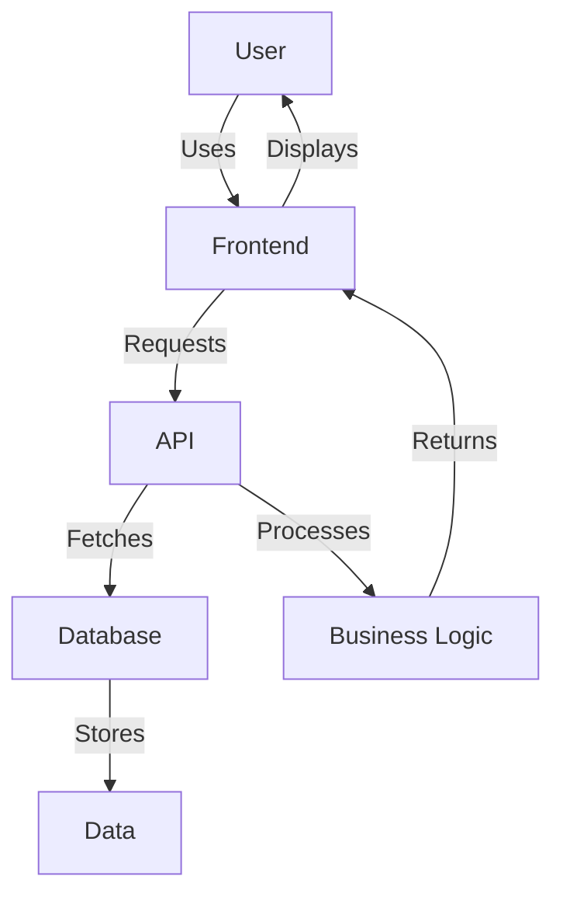

# Architecture Overview

```mermaid
graph TD;
    A[User] -->|Uses| B[Frontend]
    B -->|Requests| C[API]
    C -->|Fetches| D[Database]
    D -->|Stores| E[Data]
    C -->|Processes| F[Business Logic]
    F -->|Returns| B
    B -->|Displays| A
```